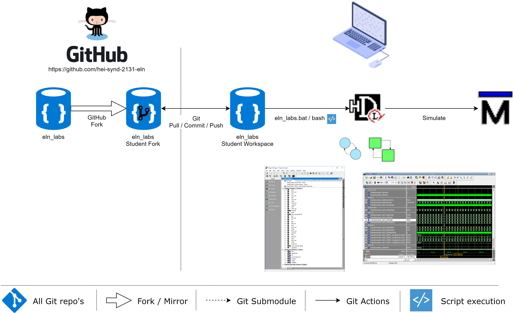

<h1 align="center">
  <br>
  
  <br>
  ELN Laboratories
  <br>
</h1>

<h4 align="center">Labor Files for ELN Laboratories practical sessions <a href="https://cyberlearn.hes-so.ch" target="_blank">Moodle Cyberlearn</a>.</h4>

# Table of contents
<p align="center">
  <a href="#description">Description</a> •
  <a href="#how-to-use">How To Use</a> •
  <a href="#download">Download</a> •
  <a href="#credits">Credits</a> •
  <a href="#license">License</a> •
  <a href="#fund-us-on">Find us on</a>
</p>


## Description
[(Back to top)](#table-of-contents)

As it changes each year, all you have to do is search on <a href="https://cyberlearn.hes-so.ch" target="_blank">Moodle Cyberlearn</a> for the course number and select the one starting with the last two digits of the current year.

Course number is 2131 for SYND

The course full name is composed as a concatenation of year (YY), school name, course ID and course name: "YY_HES-SO-VS_Systèmes numériques / Digitale Technik"

## How To Use
[(Back to top)](#table-of-contents)

To clone and run this application, you'll need [Git](https://git-scm.com) and [HDL Designer](https://www.mentor.com/products/fpga/hdl_design/hdl_designer_series/) as well as [Modelsim](https://www.mentor.com/products/fv/modelsim/) installed on your computer.

The whole system looks like this:


### SSH - *FIRST TIME ONLY*
In order of reaching the git repo, you'll need to set up an SSH connection.

Either use the script ```Scripts/generateSSHKey.bash``` or follow the instruction below.

The [Github documentation](https://docs.github.com/en/authentication/connecting-to-github-with-ssh/generating-a-new-ssh-key-and-adding-it-to-the-ssh-agent) is very helpful and beginners oriented.

Here's the condensed version.

#### Generate a key
Open a git bash command line and type (using your standard school adress):
```bash
ssh-keygen -t ed25519 -C "firstname.lastname@hevs.ch"
```
The system will ask you for a file location and a passphrase, hit only ENTER for both as you don't need fancy configuration.
```bash
Generating public/private ed25519 key pair.
Enter file in which to save the key (/c/Users/you/.ssh/id_ed25519):
Enter passphrase (empty for no passphrase):
Enter same passphrase again:
Your identification has been saved in /c/Users/you/.ssh/test
Your public key has been saved in /c/Users/you/.ssh/test.pub
The key fingerprint is:
SHA256:nThbg6kXUpJWGl7E1IGOCspRomTxdCARLviKw6E5SY8 firstname.lastname@hevs.ch
The key's randomart image is:
+--[ED25519 256]--+
|                 |
|           .     |
| .   .    . .    |
|  + .o..  .+ . . |
| o.+. .oS.Eo. o  |
| .+o   .+ oo o   |
|.o. +  . o.o. B  |
|++o= .  +  .+O o |
|+.++o    oooo.o  |
+----[SHA256]-----+

```

To finish the configuration on your PC, add the SSH key to the key manager (ssh-agent).

**Ensure that the key name is the same as the one you created before (using default configuration is the case).**
```bash
eval "$(ssh-agent -s)"
ssh-add ~/.ssh/id_ed25519
```
That's it, next step is to add the key on your Github profile.

#### Adding the key to Github
Begin by copying the key to your clipboard, for example in git bash:
```bash
clip < ~/.ssh/id_ed25519.pub
```

Then go to your [profile settings](https://github.com/settings/keys) and click "**New SSH Key**".


Enter a name for your key in the *Title* field (for example "MyLaptop") and paste the key in the *Key* field.


Then validate (and you'll may be asked for your password as you make security changes to your account) and you're ready.

#### Testing
To be sure that your key is working, you can test it:
```bash
ssh -T git@github.com
```

If such a warning occurs:
```bash
> The authenticity of host 'github.com (IP ADDRESS)' can't be established.
> RSA key fingerprint is SHA256:nThbg6kXUpJWGl7E1IGOCspRomTxdCARLviKw6E5SY8.
> Are you sure you want to continue connecting (yes/no)?
```
Type yes (if the fingerprint is the same as created) and a sucess message will show.

#### Troubleshouting
If your key is not working, ensure the basics:
- Did you add the right key?
- Did you saved the settings?
- Did you used the correct configuration to generate the key?

Else, ask the [internet](https://letmegooglethat.com/?q=github+ssh+problems) or any teacher ;)

### Launch
From your command line:
```bash
# Change to location for the Sourcecode on your PC for Example Base of Drive U:
U:

# Clone this repository
git clone https://github.com/hei-isc-eln/eln-labs.git

# Go into the repository
cd eln-labs

# Run the app
## Linux
./eln-labs.bash

## Windows
.\eln-labs.bat
```

### Update Student **Fork** to the latest modification from **Master** Repo
```bash
# goto your student fork repo location
cd u:\eln-labs\

# add upstream Master remote
git remote add upstream https://github.com/hei-isc-eln/eln-labs.git

# like "git pull" which is fetch + merge)
git fetch upstream
git merge upstream/master master

# Push the changes into your own fork repo
git push origin master
```

## Credits
[(Back to top)](#table-of-contents)
* COF
* PRC
* ZAS

## License
[(Back to top)](#table-of-contents)

:copyright: [All rights reserved](LICENSE)

---

## Find us on
> [hevs.ch](https://www.hevs.ch) &nbsp;&middot;&nbsp;
> LinkedIn [HES-SO Valais-Wallis](https://www.linkedin.com/groups/104343/) &nbsp;&middot;&nbsp;
> Youtube [HES-SO Valais-Wallis](https://www.youtube.com/user/HESSOVS)
> Twitter [@hessovalais](https://twitter.com/hessovalais) &nbsp;&middot;&nbsp;
> Facebook [@hessovalais](https://www.facebook.com/hessovalais) &nbsp;&middot;&nbsp;
